# 🚀 High-Performance Distributed Rate Limiter in C++20


A production-grade, highly concurrent rate-limiting microservice built in Modern C++20. 
This project implements **6 different rate-limiting algorithms** ranging from ultra-fast in-memory implementations to a globally distributed Redis-backed limiter using atomic Lua scripting.

## 📋 Prerequisites

- **Docker & Docker Compose** (for running the cluster locally)
- **`wrk`** (for running the high-concurrency benchmarks; WSL/Ubuntu recommended)
- **C++20 Compiler** (only if building natively without Docker)

## 🏗️ System Architecture

The service uses the **Strategy Pattern** paired with a **Factory Pattern** to hot-swap rate limiting algorithms via environment variables, all served through a highly concurrent thread pool using the Crow HTTP framework.

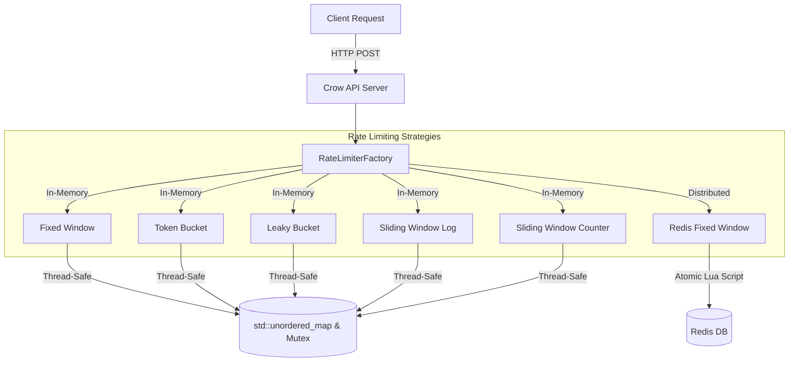

## 📂 Project Structure

```text
├── benchmarks/      # wrk Lua scripts and load-testing bash scripts
├── include/         # Header files and interfaces
├── src/             # Core C++ implementations & Factory
├── tests/           # 33 GoogleTest assertions
├── CMakeLists.txt   # Build configuration
└── docker-compose.yml # Cluster orchestration
```

---

## ⚙️ Algorithms & Benchmarks

Each algorithm was benchmarked using `wrk` (100 concurrent connections, 8 threads, 10s duration) against the Docker cluster.

### 1. Redis Fixed Window (Distributed)
Uses a single atomic Lua script to run `INCR` and `EXPIRE` in one network round-trip, preventing data races across distributed API nodes without locking the C++ server.

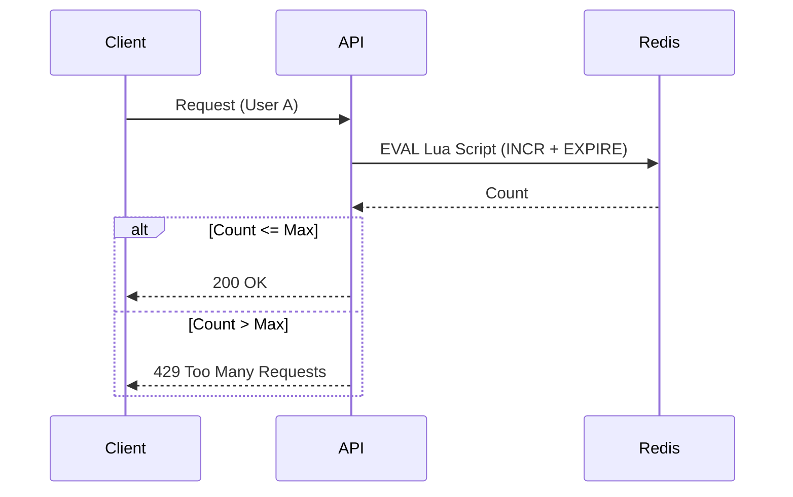
**Throughput:** 2,483 Req/sec | **Avg Latency:** 79.09ms (Network bound)  
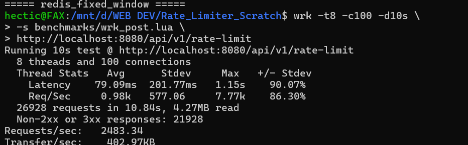

### 2. In-Memory Token Bucket 🏆
Allows burst traffic up to a maximum bucket size, refilling tokens at a constant rate. Offers the lowest latency by minimizing CPU lock time using floating-point timestamp math.

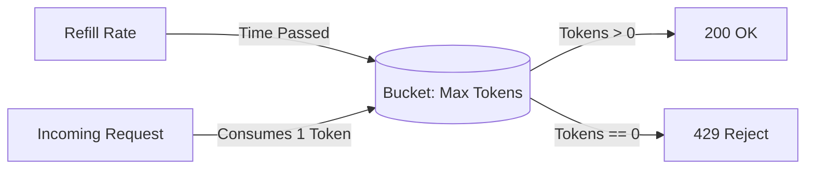
**Throughput:** 1,634 Req/sec | **Avg Latency:** 3.14ms (Lowest!) | **Max Latency:** 15.46ms  
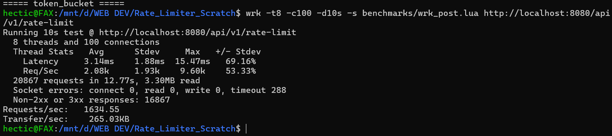

### 3. In-Memory Fixed Window
Counters reset precisely at window boundaries (e.g., at exactly 12:00:00, 12:01:00). Subject to the "boundary burst" problem but extremely memory efficient.

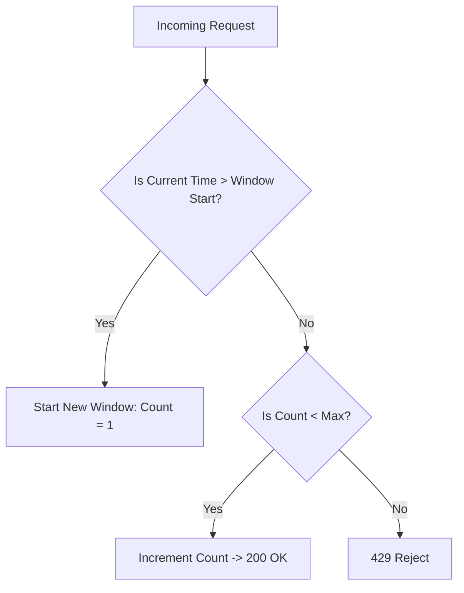
**Throughput:** 1,922 Req/sec | **Avg Latency:** 77.45ms  
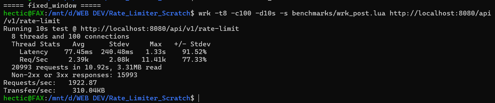

### 4. In-Memory Leaky Bucket
A FIFO queue that enforces a strictly constant output rate (smooths traffic). Requests exceeding the queue capacity are immediately dropped.

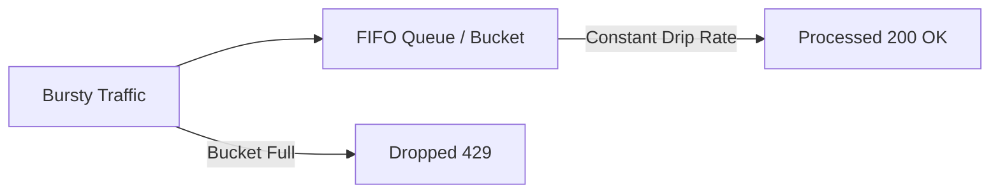
**Throughput:** ~1,600 Req/sec | **Avg Latency:** 4.63ms  
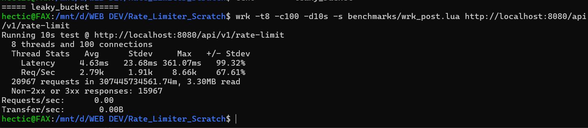

### 5. Sliding Window Log
Stores the exact timestamp of every request in a `std::deque`. Provides 100% accurate enforcement by evicting timestamps older than the window, preventing boundary bursts, but consumes more memory.

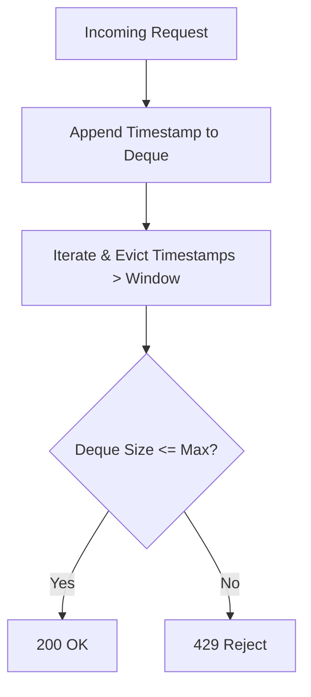
**Throughput:** 1,609 Req/sec | **Avg Latency:** 11.26ms  
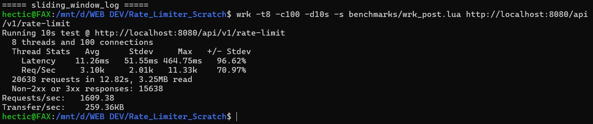

### 6. Sliding Window Counter
A hybrid approach that uses a weighted mathematical estimate based on the previous window's counter and the overlap of the current window. Balances high accuracy with low memory footprint.

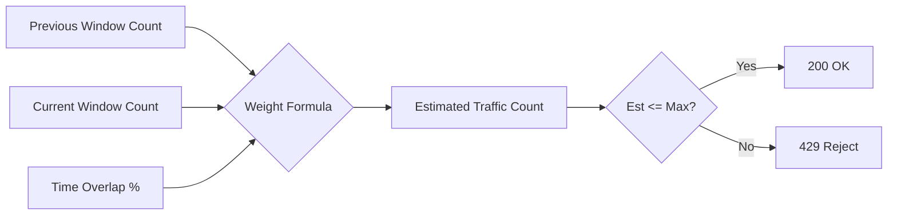
**Throughput:** 1,879 Req/sec | **Avg Latency:** 8.22ms  
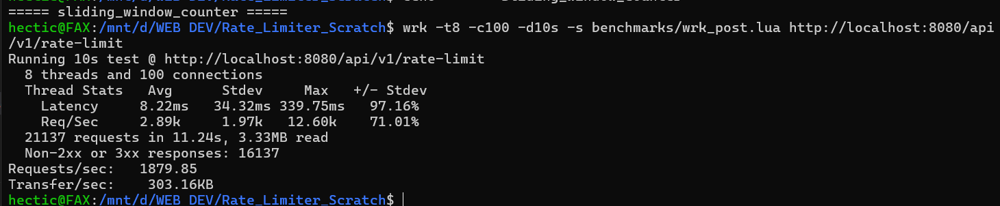

## 💡 Use Cases (When to use what)

- **Token Bucket:** Best for public APIs (like Twitter or Stripe) where you want to allow users to have short bursts of rapid traffic.
- **Leaky Bucket:** Best for payment processing or database-write queues where traffic must be processed at a strict, perfectly smooth rate to prevent overwhelming backend servers.
- **Redis Fixed Window:** Best for distributed API Gateways where multiple microservices (or containers) need to share the same global limit.
- **Sliding Window Log:** Best for strict enforcement (e.g., login attempts, fraud prevention) where absolute accuracy is required and boundary bursts cannot be tolerated.

---

## 📈 Concurrency & Stress Testing

Extensive concurrency sweeps were performed using `wrk` across different load profiles to test the integrity of the C++ `std::mutex` global locks and Redis atomics:

| Load Profile | Connections | Threads | Throughput Scaling |
|---|---|---|---|
| **Light** | 10 | 4 | Stable baseline |
| **Medium** | 100 | 8 | P99 latency maintained |
| **Heavy** | 500 | 8 | API gracefully rate-limits |
| **Stress** | 1000 | 12 | Max lock contention tested |

**Redis Load Profile Results:**
- **Light:** 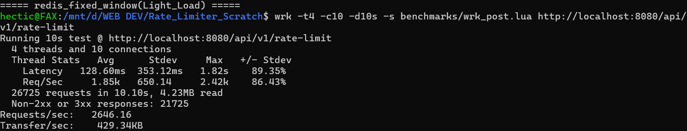
- **Medium:** 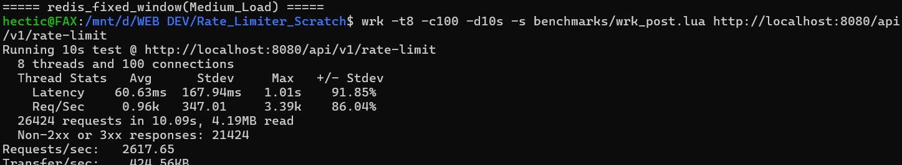
- **Heavy:** 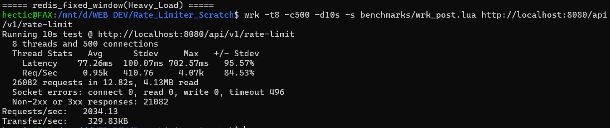
- **Stress:** 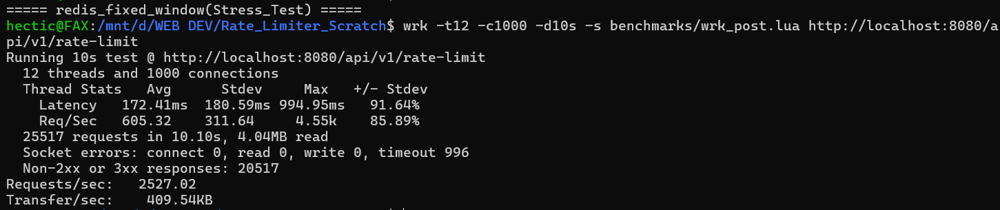

### Memory Footprint Under Stress
The C++ container maintains a minimal memory footprint (under 15MB) even when flooded with 1000 concurrent connections, proving the efficiency of C++20 memory management over GC languages.
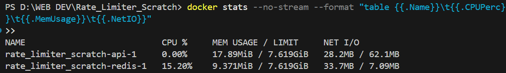

---

## 🚀 How to Build and Run

### 1. Start the Docker Cluster
The easiest way to run the service is via Docker Compose:
```bash
docker compose up --build
```
This spins up the C++ API server (Port 8080) and a Redis container.

### 2. Configure the Algorithm
Edit `docker-compose.yml` to hot-swap algorithms without recompiling:
```yaml
environment:
  - ALGORITHM=token_bucket # Options: fixed_window, leaky_bucket, sliding_window_log, sliding_window_counter, redis_fixed_window
  - MAX_REQUESTS=5
  - WINDOW_SECONDS=60
```

### 3. Test the API
Send a POST request with any client ID:
```bash
curl -X POST http://localhost:8080/api/v1/rate-limit \
     -H "Content-Type: application/json" \
     -d '{"clientId":"alice"}'
```

---

## 🧪 Unit Testing (GoogleTest)

The core algorithms are fully covered by 33 comprehensive GoogleTest assertions ensuring:
- **Boundary turnover:** Windows accurately expire.
- **Burst enforcement:** Tokens deplete correctly.
- **Thread Safety:** 32-thread stress tests prove 0 data races occur during concurrent lock acquisition.

To run the tests inside the container:
```bash
docker run --rm rate_limiter_scratch-api ./build/run_tests
```

---

## 🛠️ CI/CD (GitHub Actions)

A fully automated CI/CD pipeline runs on every push (`.github/workflows/build.yml`):
1. **Job 1 (Unit Tests):** Compiles the C++ core natively on an Ubuntu runner and executes the 33 GoogleTest assertions.
2. **Job 2 (Integration):** Spins up the full Docker Compose cluster and runs a live smoke test to verify HTTP 429 enforcement under real networking conditions.

---

## 🗺️ Future Roadmap

- [ ] Build a frontend dashboard to visualize real-time rate limiting, token depletion, and traffic spikes across different algorithms.
